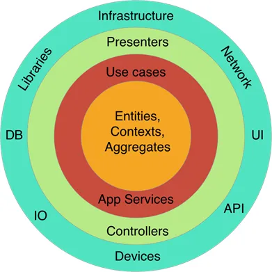
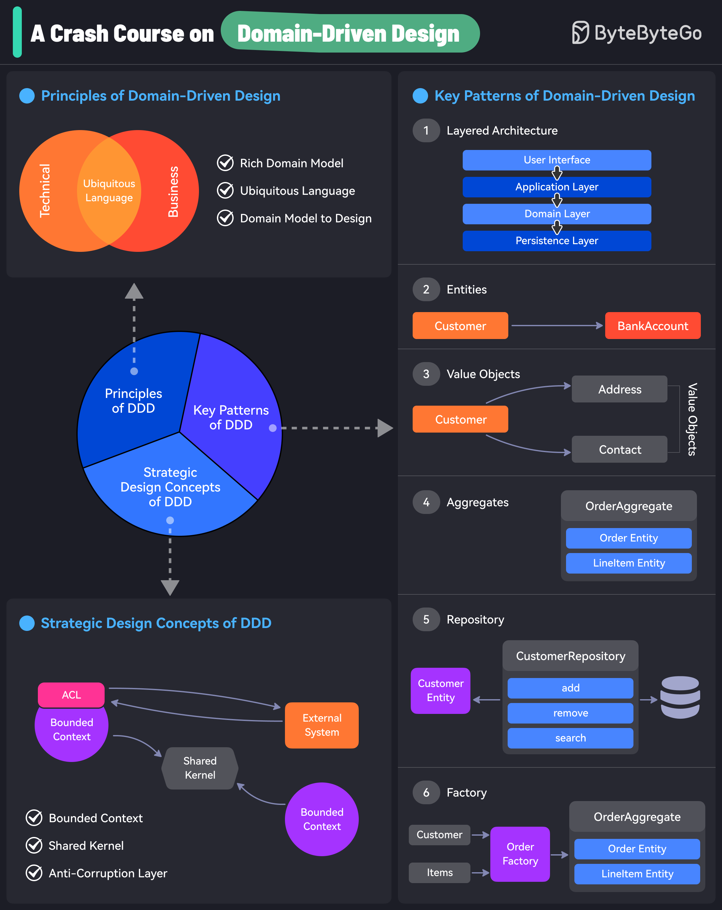
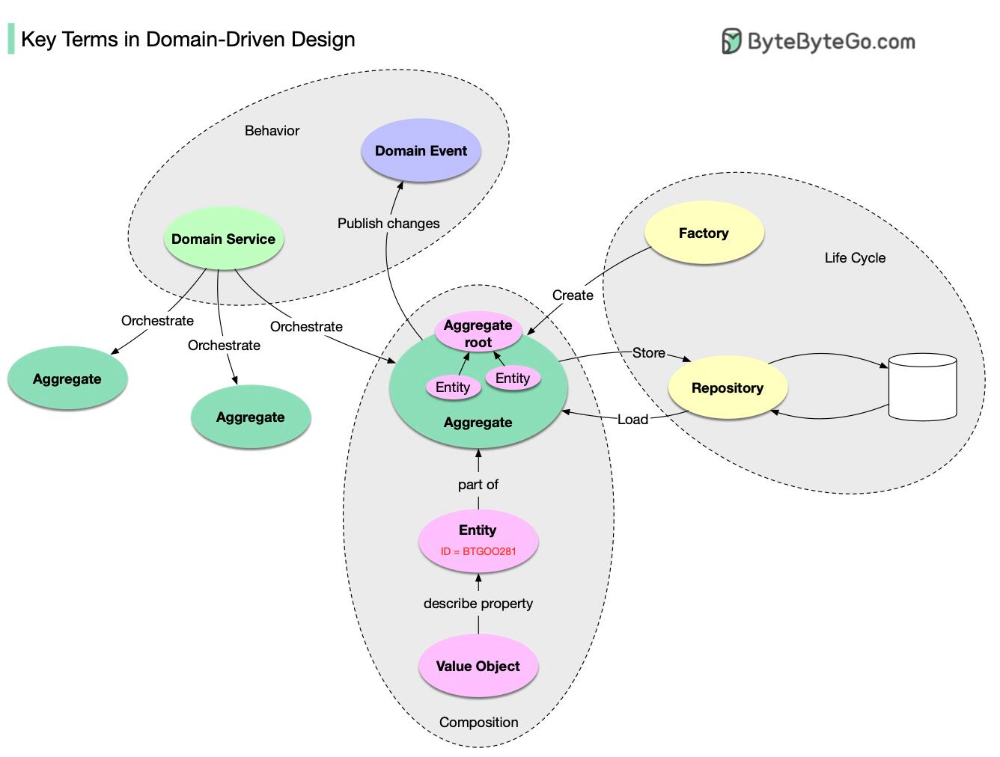

# Domain-Drive Design (DDD)

## What is it?

DDD was introduced in Eric Evans’ classic book “Domain-Driven Design: Tackling Complexity in the Heart of Software”.

DDD is an approach to software development that tackles domain complexity by emphasizing the importance of modeling the **core domain** and **business logic** and using those models as **the foundation** for software design.

At its heart, Domain-Driven Design is about:

- Placing the primary focus on the core domain.
- Basing complex designs on a model of the domain
- Building collaboration between technical and domain experts.

## Basics of Domain-Driven Design and its key concepts

### Principles of Domain-Driven Design

- Rich domain model
- Ubiquitous language
- Domain Model to Design

### Key patterns of Domain-Driven Design

#### The composition of domain objects

- Entity: a domain object that has ID and life cycle.
- Value Object: a domain object without ID. It is used to describe the property of Entity.
- Aggregate: a collection of Entities that are bounded together by Aggregate Root (which is also an entity). It is the unit of storage.
  - Aggregate Root: An Aggregate in DDD is a cluster of related objects that are treated as a single unit. Each Aggregate has a designated entry point, known as the Aggregate Root. The Aggregate Root controls access to the objects within the Aggregate and enforces invariants and business rules within the domain. This concept provides a way to encapsulate related domain objects, ensuring data consistency and integrity.

#### The life-cycle of domain objects

- Repository: manages the persistence and retrieval of aggregates.
- Factory: Handles the creation of complex objects or aggregates. It encapsulates the complex logic of object creation, ensuring that all necessary properties are set and any business rules are followed during creation.

#### Behavior of domain objects

- Domain event: Domain events are used to communicate changes in the state of the business. The publication is made public so others can consume and reconstruct it.
- Domain service: Orchestrate multiple Aggregate. Used to encapsulate domain logic that doesn't naturally fit within a single entity or value object. They're particularly useful for operations that involve multiple domain objects or complex business rules that don't belong to any specific entity.

### Strategic design concepts of DDD

- Bounded context: In domain-driven design (DDD), a bounded context is a organizational boundary defining a specific business domain area. A bounded context defines a specific set of concepts, terminology, and business rules that apply within that context while excluding concepts and rules that apply in other contexts.

E.g: https://miro.medium.com/v2/resize:fit:1400/format:webp/0*XFcCdIE6ouplygpV.png

- Share Kernel: Contains common base classes and interfaces used across bounded contexts.

E.g: BaseEntity, IDomainEvent, and ISpecification

- Anti-Corruption layer:

The Anti-Corruption Layer (ACL) in Domain-Driven Design (DDD) is a strategic design pattern that helps ensure systems remain independent and unpolluted by external systems that may have different domain models. The primary goal of the ACL is to isolate and protect the core domain model from external systems, preventing "corruption" or unnecessary dependencies from outside systems that may negatively influence or distort the internal domain logic.

E.g: Imagine you are building an e-commerce application, and you need to integrate with a **third-party** payment gateway. The third-party system may have **its own domain model** for orders, payments, and users. Instead of allowing this external model to infiltrate your e-commerce domain, you use an ACL to adapt the third-party's model to your own, maintaining your business logic's integrity.

The ACL can be implemented using various design patterns such as:

- **Adapter Pattern**: For transforming data and interfaces between systems.
- **Facade Pattern**: To simplify and provide a unified interface for interacting with complex external systems.
- **Translator/Mapper**: For converting data from one model to another.

## Resources

- https://en.wikipedia.org/wiki/Domain-driven_design
- https://learn.microsoft.com/en-us/archive/msdn-magazine/2009/february/best-practice-an-introduction-to-domain-driven-design
- https://redis.io/glossary/domain-driven-design-ddd/
- https://www.geeksforgeeks.org/domain-driven-design-ddd/
- https://towardsdev.com/you-dont-need-a-book-to-know-ddd-30cd036843bc
- https://awesome-architecture.com/domain-driven-design/aggregation/
- Aggregates: https://medium.com/@aforank/domain-driven-design-aggregates-in-practice-bcced7d21ae5
- Bouneded context: https://blog.bitsrc.io/understanding-the-bounded-context-in-microservices-c70c0e189dd1

- Images:

  - https://blog.bytebytego.com/i/84137023/domain-driven-design-ddd
  - https://substackcdn.com/image/fetch/f_auto,q_auto:good,fl_progressive:steep/https%3A%2F%2Fbucketeer-e05bbc84-baa3-437e-9518-adb32be77984.s3.amazonaws.com%2Fpublic%2Fimages%2F4138b20e-ac72-40a7-a753-cfb1916be3c0_1336x1012.jpeg

- Repositories:

  - https://github.com/ardalis/cleanarchitecture

- Books:

  - https://fabiofumarola.github.io/nosql/readingMaterial/Evans03.pdf
  - https://www.workingsoftware.dev/the-ultimate-list-of-domain-driven-design-books-in-2024/

- Courses:
  - https://www.youtube.com/playlist?list=PLYpjLpq5ZDGstQ5afRz-34o_0dexr1RGa
  - https://blog.bytebytego.com/p/a-crash-course-on-domain-driven-design
  - https://www.pluralsight.com/courses/fundamentals-domain-driven-design
