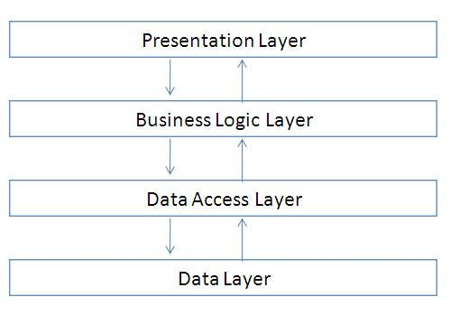

# N-tier Architecture

An N-tier architecture divides an application into **logical layers** and **physical tiers**. These are the presentation tier, processing or logic tier, and data tier.


Layers are a way to separate responsibilities and manage dependencies. Each layer has a specific responsibility. A higher layer can use services in a lower layer, but not the other way around.
Tiers are physically separated, and they can also run on separate machines. A tier can call to another tier directly, or use asynchronous messaging (message queue). Although each layer might be hosted in its own tier, that's not required. Several layers might be hosted on the same tier.

## Benefits

- Physically separating the tiers improves scalability and resiliency.
- The separation of concerns into distinct layers promotes modularity, making it easier to understand, develop, and maintain each component independently.
- Components within each tier can be reused in different parts of the application or even in different parts of the application or even in different applications altogether.
- Less learning curves.

## Drawbacks

- Complexity: N-tier architecture can be complex, as it involves multiple layers and components
- Performance: Communication between different tiers, can introduce latency and overhead.

## Project Structure

```
🛠️MyApp.sln/
│
├── #️⃣MyApp.API/                   # Presentation Layer (API)
│   ├── 📂Controllers/              # API Controllers
│   │   └── TodoController.cs
│   ├── Startup.cs                # Application startup configuration
│   └── ...                        # Other API-related files
│
├── #️⃣MyApp.BusinessLogic/         # Business Logic Layer
│   ├── 📂Interfaces           # Interfaces for MyApp service
│   |     ├── ITodoService.cs
│   ├── 📂Models                   # TODO (models | entities)
│   |     ├── Todo.cs
│   ├── TodoService.cs            # Implementation of MyApp service
│   └── ...                        # Other business logic files
│
├── #️⃣MyApp.DataAccess/            # Data Access Layer
│   ├── ApplicationDbContext.cs   # Entity Framework DbContext
│   ├── TodoRepository.cs         # Repository for MyApp data access
│   └── ...                        # Other data access files
```
